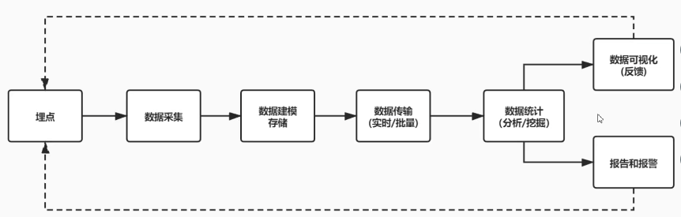
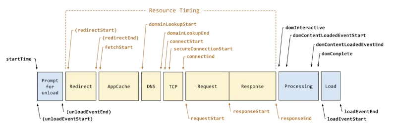
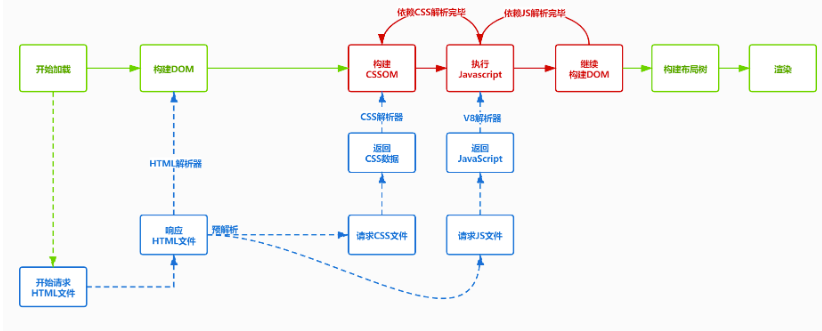

## 前端监控的基本流程

在这个流程当中其实前端主要的工作是前面的 *埋点、数据收集* 这几个工作，后面的工作可以交给云服务器的**日志服务系统（sls）**去处理。

## 常见的埋点方案

### 代码埋点

+ 代码埋点，就是以嵌入代码的形式进行埋点，比如需要监控用户的点击事件，会选择在用户点击时，插入一段代码，保存这个监听行为或者直接将监听行为以某一种数据格式直接传递给服务器端
+ 优点是可以在任意时刻，精确的发送或保存所需要的数据信息
+ 缺点是工作量较大

### 可视化埋点

+ 通过可视化交互的手段，代替代码埋点
+ 将业务代码和埋点代码分离，提供一个可视化交互的页面，输入为业务代码，通过这个可视化系统，可以在业务代码中自定义的增加埋点事件等等，最后输出的代码耦合了业务代码和理点代码
+ 可视化埋点其实是用系统来代替手工插入埋点代码

### 无痕埋点

+ 前端的任意一个事件都被绑定一个标识，所有的事件都别记录下来
+ 通过定期上传记录文件，配合文件解析，解析出来我们想要的数据，并生成可视化报告供专业人员分析
+ 无痕埋点的优点是采集全量数据，不会出现漏埋和误埋等现象
+ 缺点是给数据传输和服务器增加压力，也无法灵活定制数据结构

## 加载时间性能监控

| 字段                       | 含义                                                         |
| -------------------------- | ------------------------------------------------------------ |
| navigationStart            | 初始化页面，在同一个浏览器上下文中前一个页面unload的时间戳，如果没有前一个页面的unload,则与fetchStart值相等 |
| redirectStart              | 第一个HTTP重定向发生的时间,有跳转且是同域的重定向,否则为0    |
| redirectEnd                | 最后一个重定向完成时的时间,否则为0                           |
| fetchStart                 | 浏览器准备好使用http请求获取文档的时间,这发生在检查缓存之前  |
| domainLookupStart          | DNS域名开始查询的时间,如果有本地的缓存或keep-alive则时间为0  |
| domainLookupEnd            | DNS域名结束查询的时间                                        |
| connectStart               | TCP开始建立连接的时间,如果是持久连接,则与`fetchStart`值相等  |
| secureConnectionStart      | https 连接开始的时间,如果不是安全连接则为0                   |
| connectEnd                 | TCP完成握手的时间，如果是持久连接则与`fetchStart`值相等      |
| requestStart               | HTTP请求读取真实文档开始的时间,包括从本地缓存读取            |
| requestEnd                 | HTTP请求读取真实文档结束的时间,包括从本地缓存读取            |
| responseStart              | 返回浏览器从服务器收到（或从本地缓存读取）第一个字节时的Unix毫秒时间戳 |
| responseEnd                | 返回浏览器从服务器收到（或从本地缓存读取，或从本地资源读取）最后一个字节时的Unix毫秒时间戳 |
| unloadEventStart           | 前一个页面的unload的时间戳 如果没有则为0                     |
| unloadEventEnd             | 与`unloadEventStart`相对应，返回的是`unload`函数执行完成的时间戳 |
| domLoading                 | 返回当前网页DOM结构开始解析时的时间戳,此时`document.readyState`变成loading,并将抛出`readyStateChange`事件 |
| domInteractive             | 返回当前网页DOM结构结束解析、开始加载内嵌资源时时间戳,`document.readyState` 变成`interactive`，并将抛出`readyStateChange`事件(注意只是DOM树解析完成,这时候并没有开始加载网页内的资源) |
| domContentLoadedEventStart | 网页domContentLoaded事件发生的时间                           |
| domContentLoadedEventEnd   | 网页domContentLoaded事件脚本执行完毕的时间,domReady的时间    |
| domComplete                | DOM树解析完成,且资源也准备就绪的时间,`document.readyState`变成`complete`.并将抛出`readystatechange`事件 |
| loadEventStart             | load 事件发送给文档，也即load回调函数开始执行的时间          |
| loadEventEnd               | load回调函数执行完成的时间                                   |

### 阶段计算

| 字段             | 描述                                 | 计算方式                                              | 意义                                                         |
| ---------------- | ------------------------------------ | ----------------------------------------------------- | ------------------------------------------------------------ |
| unload           | 前一个页面卸载耗时                   | unloadEventEnd – unloadEventStart                     | -                                                            |
| redirect         | 重定向耗时                           | redirectEnd – redirectStart                           | 重定向的时间                                                 |
| appCache         | 缓存耗时                             | domainLookupStart – fetchStart                        | 读取缓存的时间                                               |
| dns              | DNS 解析耗时                         | domainLookupEnd – domainLookupStart                   | 可观察域名解析服务是否正常                                   |
| tcp              | TCP 连接耗时                         | connectEnd – connectStart                             | 建立连接的耗时                                               |
| ssl              | SSL 安全连接耗时                     | connectEnd – secureConnectionStart                    | 反映数据安全连接建立耗时                                     |
| ttfb             | Time to First Byte(TTFB)网络请求耗时 | responseStart – requestStart                          | TTFB是发出页面请求到接收到应答数据第一个字节所花费的毫秒数   |
| response         | 响应数据传输耗时                     | responseEnd – responseStart                           | 观察网络是否正常                                             |
| dom              | DOM解析耗时                          | domInteractive – responseEnd                          | 观察DOM结构是否合理，是否有JS阻塞页面解析                    |
| dcl              | DOMContentLoaded 事件耗时            | domContentLoadedEventEnd – domContentLoadedEventStart | 当 HTML 文档被完全加载和解析完成之后，DOMContentLoaded 事件被触发，无需等待样式表、图像和子框架的完成加载 |
| resources        | 资源加载耗时                         | domComplete – domContentLoadedEventEnd                | 可观察文档流是否过大                                         |
| domReady         | DOM阶段渲染耗时                      | domContentLoadedEventEnd – fetchStart                 | DOM树和页面资源加载完成时间，会触发`domContentLoaded`事件    |
| 首次渲染耗时     | 首次渲染耗时                         | responseEnd-fetchStart                                | 加载文档到看到第一帧非空图像的时间，也叫白屏时间             |
| 首次可交互时间   | 首次可交互时间                       | domInteractive-fetchStart                             | DOM树解析完成时间，此时document.readyState为interactive      |
| 首包时间耗时     | 首包时间                             | responseStart-domainLookupStart                       | DNS解析到响应返回给浏览器第一个字节的时间                    |
| 页面完全加载时间 | 页面完全加载时间                     | loadEventStart - fetchStart                           | -                                                            |
| onLoad           | onLoad事件耗时                       | loadEventEnd – loadEventStart                         |                                                              |

### 性能指标

[PerformanceObserver.observe](https://developer.mozilla.org/zh-CN/docs/Web/API/PerformanceObserver/observe)方法用于观察传入的参数中指定的性能条目类型的集合。当记录一个指定类型的性能条目时，性能监测对象的回调函数将会被调用

- entryType
- paint-timing
- event-timing
- LCP
- FMP
- time-to-interactive

https://developer.mozilla.org/en-US/docs/Web/API/PerformanceEntry/entryType

|      |                                          |                                                              |
| ---- | ---------------------------------------- | ------------------------------------------------------------ |
| 字段 | 描述                                     | 备注                                                         |
| FP   | First Paint(首次绘制)                    | 包括了任何用户自定义的背景绘制，它是首先将像素绘制到屏幕的时刻 |
| FCP  | First Content Paint(首次内容绘制)        | 是浏览器将第一个 DOM 渲染到屏幕的时间,可能是文本、图像、SVG等,这其实就是白屏时间 |
| FMP  | First Meaningful Paint(首次有意义绘制)   | 页面有意义的内容渲染的时间                                   |
| LCP  | (Largest Contentful Paint)(最大内容渲染) | 代表在viewport中最大的页面元素加载的时间                     |
| DCL  | (DomContentLoaded)(DOM加载完成)          | 当 HTML 文档被完全加载和解析完成之后, DOMContentLoaded 事件被触发，无需等待样式表、图像和子框架的完成加载 |
| L    | (onLoad)                                 | 当依赖的资源全部加载完毕之后才会触发                         |
| TTI  | (Time to Interactive) 可交互时间         | 用于标记应用已进行视觉渲染并能可靠响应用户输入的时间点       |
| FID  | First Input Delay(首次输入延迟)          | 用户首次和页面交互(单击链接，点击按钮等)到页面响应交互的时间 |

## 参考

https://github.com/miracle90/monitor